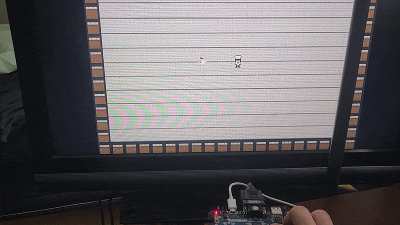

# Basys 3 VGA Game

A simple game/sprite-rendering-system, implemented using Verilog on a 
Digilent Basys 3 FPGA. The project generates a VGA video signal and uses 
the FPGA hardware to handle logic, rendering, and input signals.

## Demo

<p align="center">
  
</p>

## Overview

This project was developed to start exploring FPGA technology, as well 
as digital hardware design. The rendering of the game and the logic are 
directly implemented directly in hardware using Verilog.

## Hardware

- Digilent Basys 3 FPGA
- VGA display

## Features

- VGA video output
- Hardware-based graphic rendering
- Tile-based background
- Sprite graphics stored in memory
- Player/button-based movement
- Automated movement

## Project Structure

```text
Basys3-VGA-Game/
├── src/           # Verilog source files
├── mem/           # Sprite and tile memory files
└── constraints/   # Basys 3 pin constraints